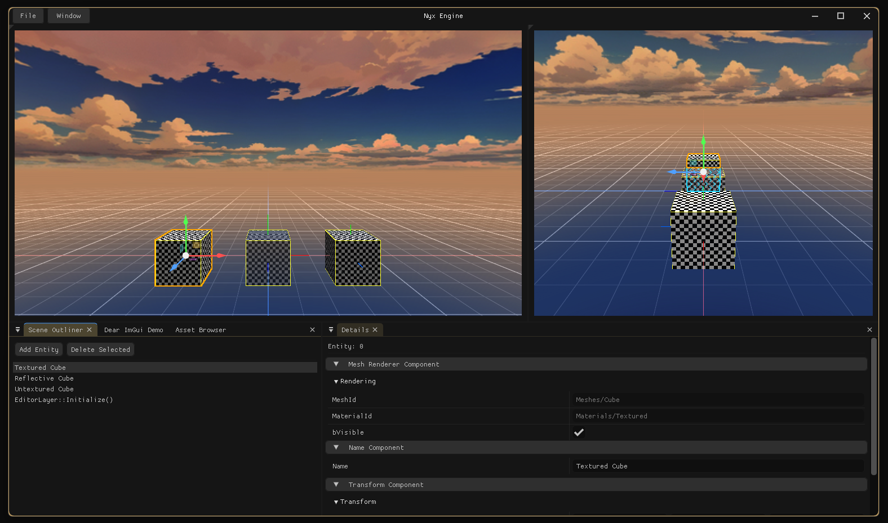

# Nyx

A hobby game engine and editor written in C++20, rendering with Vulkan.

Having worked on and with a variety of proprietary and off-the-shelf engines so far, I've started to feel the need to start implementing my own and from scratch - not just as an additional learning opportunity, but also to create my personal collection of 'best-of's of what I've worked with thus far. While being actively developed in my spare time, this project is still very much in its infancy at this point in time, with many of its key structures likely to change.



## Features

- Editor with scene outliner, details panel, asset browser and two viewports
- Picking, transform gizmo, undo/redo
- Vulkan renderer
- Reflection system (see below)
- Animated startup banner

## Getting started

### Requirements

- Windows 10 or 11
- Visual Studio 2022 with the *Desktop development with C++* workload
- CMake 3.23 or newer
- [Vulkan SDK](https://vulkan.lunarg.com/) (provides the Vulkan headers and `glslc`)

### Clone

The dependencies are git submodules, so clone recursively:

```powershell
git clone --recursive https://github.com/LeonPapadopoulos/nyx.git
```

For an existing clone: `git submodule update --init --recursive`.

### Build and run

| Script | What it does |
| --- | --- |
| `Scripts\BuildEditor.bat` | Generates the project files and builds the editor (Debug) |
| `Scripts\BuildGame.bat` | Builds the game (Debug) and runs a scene: the file passed as argument, or `Assets\Scenes\Default.nyxscene` |
| `Scripts\GenerateProjectFiles.bat` | Generates the Visual Studio solution in `Build\Windows` |
| `Scripts\RebuildProjectFiles.bat` | Deletes `Build\Windows` and generates it again |
| `Scripts\BuildStartupPreview.bat` | Builds and opens the startup banner preview tool |
| `Scripts\FormatCode.bat` | Formats the code with clang-format (`check` only lists unformatted files) |

The editor ends up in `Build\Windows\Binaries\Debug\NyxEditor.exe`, the game next to it in `NyxGame.exe`. To work in Visual Studio, open the generated solution in `Build\Windows`; `NyxEditor` is the startup project.

In the editor, **Play** in the titlebar runs the open scene in `NyxGame.exe`, as a separate program and with unsaved changes included. **Stop** asks the game to quit, and ends it if it hasn't after 3 seconds; clicking *Stopping* ends it at once. To debug the game, either right-click Play and turn on *Game Waits for Debugger*, then attach Visual Studio to `NyxGame.exe`, or install the Visual Studio extension *Microsoft Child Process Debugging Power Tool 2022+* and turn on child process debugging under *Debug > Other Debug Targets > Child Process Debugging Settings*; Visual Studio then attaches to the game by itself when the editor starts it.

The game connects back to the editor that started it, over the *editor link*: a TCP connection on `127.0.0.1` with a port the system picks, so only programs on this machine can connect. Both programs log when the link connects and when it ends, and hovering **Stop** shows its state. `NyxEditorLinkTests` tests the link with both ends in one program.

The editor's *Game Link* window (*Window > Game Link*) shows the game's log lines in the *Game Log* tab, and every message of the link, in both directions, in the *Messages* tab: select a message to see all its fields, or pause, filter by type and copy. *Record* there writes each play session's messages to a `.nyxlinklog` file in a `LinkLogs` folder next to the editor; `NyxGame.exe --link-log <file>` records the game's side.

To see what a scene file or a link recording contains, build `NyxDump` and print the file with it, e.g. from the repository folder: `Build\Windows\Binaries\Debug\NyxDump.exe Assets\Scenes\Default.nyxscene`, or a `.nyxlinklog` file the same way.

## Project layout

```
Assets/          Scenes, meshes, materials, textures and startup artwork
Dependencies/    Git submodules: spdlog, GLFW, GLM, cgltf
Docs/            Images used by this README
Editor/          NyxEditor.exe: editor panels, gizmo, transactions and asset database
Engine/
  Shaders/       GLSL shaders, compiled to SPIR-V during the build
  Source/
    Runtime/     Core (logging, assertions, paths), Engine (entities,
                 components, serialization), Renderer (Vulkan)
    Reflection/  Reflection types and the NYX_REFLECT / NYX_PROPERTY macros
Game/            NyxGame.exe: runs a scene through its camera, without the editor
Scripts/         Build and formatting scripts
Startup/         The startup banner and its intro animations
ThirdParty/      Vendored libraries: Dear ImGui, stb_image
Tools/
  NyxDump/       Prints scene files and link recordings as readable text
  NyxHeaderTool/ Reflection code generator and its tests
```

`NyxEngine` is a static library without any editor code. `NyxEditor` links it and adds the editor as a layer of the application; `NyxGame` links it and adds a layer that runs one scene.

## Reflection

Example of how to expose something to the reflection system and thus others like the editor inspector:

```cpp
NYX_REFLECT(Component, meta = (DisplayName = "Transform Component"))
struct TransformComponent
{
    NYX_PROPERTY(Edit, Undo, Serialize, meta = (Category = "Transform", DragSpeed = 0.1))
    glm::vec3 Position{ 0.0f };
    // ...
};

#include "Generated/Runtime/TransformComponent.reflect.h"
```

During the build, `NyxHeaderTool` reads every header in `Runtime/Engine/include` and `Runtime/Renderer/include` and writes the generated files to `Build\Windows\Generated`.

The tool's tests compare its output against golden files: `Tools\NyxHeaderTool\tests\RunHeaderToolTests.bat`.

## Third-party libraries

| Library | Used for |
| --- | --- |
| [GLFW](https://www.glfw.org/) | Window and input |
| [Vulkan](https://www.vulkan.org/) | Rendering |
| [Dear ImGui](https://github.com/ocornut/imgui) (docking branch) | Editor UI |
| [GLM](https://github.com/g-truc/glm) | Maths |
| [spdlog](https://github.com/gabime/spdlog) | Logging |
| [stb_image](https://github.com/nothings/stb) | Image loading |
